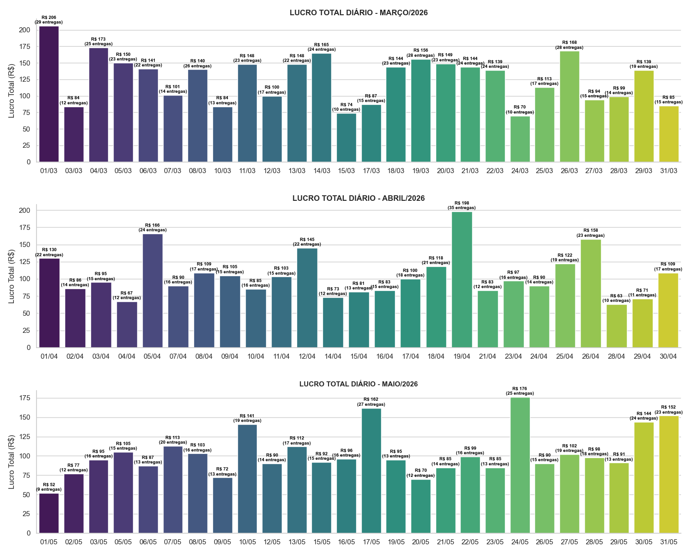
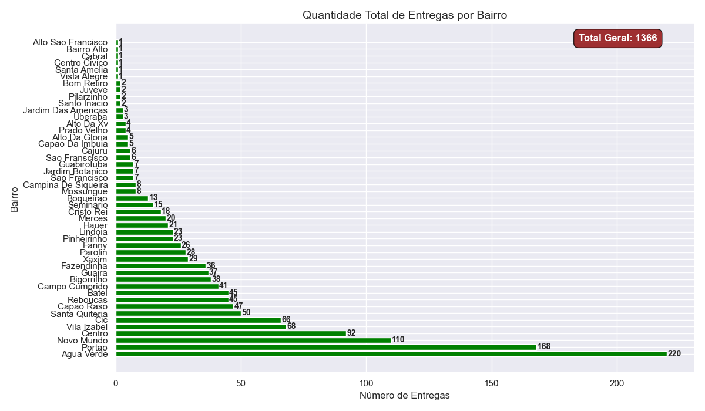
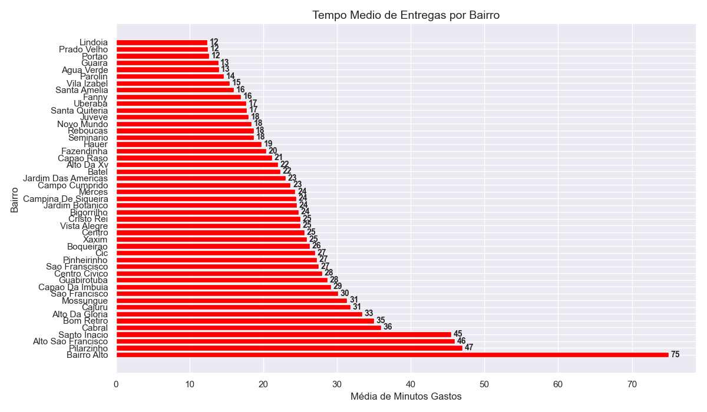
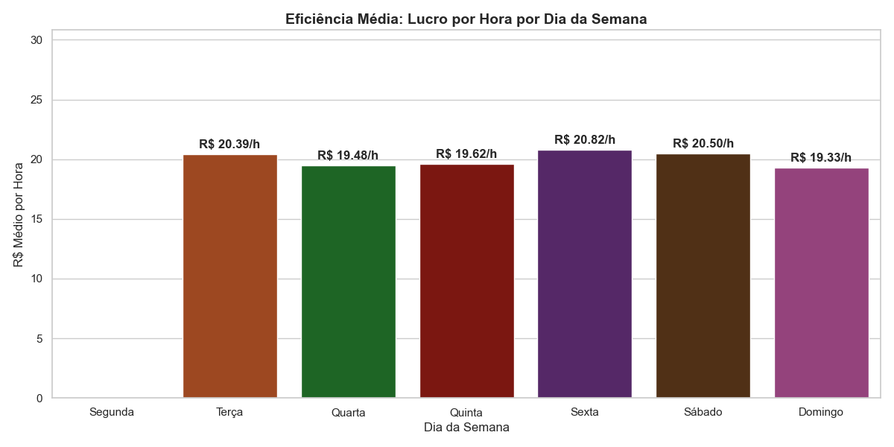
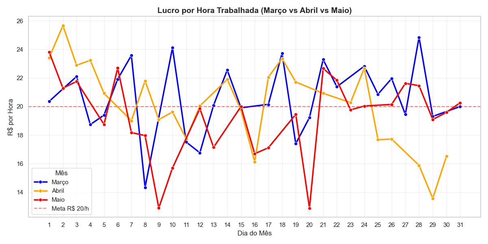

# 🏍️ Pipeline de Automação e Análise de Logística Pessoal

Este projeto implementa um pipeline de **ETL (Extract, Transform, Load)** automatizado para monitorar, estruturar e analisar a performance financeira e operacional de entregas expressas na cidade de Curitiba-PR.
O objetivo central do projeto é avaliar a viabilidade de atingir a meta operacional de **R$ 20,00 por hora trabalhada** através da otimização de rotas e análise regional.

Tecnologias Utilizadas

    Linguagem: Python 3.13

    Manipulação de Dados: Pandas

    Gerenciamento de Arquivos: Pathlib (Manipulação dinâmica de caminhos do OS)

    Banco de Dados: SQLite3

    Visualização: Matplotlib & Seaborn

    Versionamento: Git

Funcionalidades do Projeto:

    ETL (Extract, Transform, Load):
        Extração (Extract): Varredura automática da pasta `relatorios/` capturando apenas arquivos com a extensão `.csv`.

        Transformação (Transform): Normalização de colunas (remoção de espaços em branco, strings em caixa baixa e substituição por `_`).

        Limpeza de caracteres monetários (`R$`) via Regex e conversão para tipo numérico (`float`).

        Tratamento de acentuação e padronização de strings de texto utilizando formato `Title Case` para os bairros de Curitiba.

        Conversão e formatação de strings temporais para objetos `datetime`.         

        Criação de Feature: Cálculo do tempo líquido de entrega em minutos (`pedido_entregue` - `pedido_coletado`).

        Filtro de Outliers: Expulsão automática do dataset de registros com tempos negativos, zerados ou taxas inválidas (`.dropna()`).

        Carga (Load): Consolidação das tabelas mensais (`pd.concat`) e persistência automatizada no arquivo `logistica_pessoal.db`.

        Integração com Outlook: Dispara um processo em segundo plano para criar um item de e-mail formatado em HTML, garantindo uma
        leitura limpa e profissional.

    SQL:
        Agrupamento de volume mensal de pedidos e indeficaçao do melhor bairro

    
    Relatório Visual:
        Geração de gráficos comparativos de faturamento e eficiência (Earning Per Hour - EPH).

Conclusão
   Durante o período de três meses analisado, houve variações na jornada diária de trabalho (oscilando entre 5 a 8 horas por dia) 
   e alteração nas taxas. A análise de dados gerou os seguintes *insights*:

        lucro_total_diario_comparativo.png: Comparação de faturamento real entre os meses (Março vs Abril vs Maio).
            Gráfico demostrativo da variaçao de lucro de acordo com as entregas feitas e destacando que mesmo que haja um volume parecido
            de entregas de um dia para o outro, ainda sim, pode-se ter uma diferença gritante no lucro ao final do dia.
        
       

        quantidade_entregas_bairro.png: Ranking total de volume nos bairros de CURITIBA - PR .
            Embora bairros centrais e populosos como Água Verde e Portão concentrem a maior volumetria absoluta de pedidos devido à alta densidade de restaurantes, eles operam frequentemente com taxas mínimas por causa da curta distância de entrega.
        
        
        tempo_medio_entregas_bairro.png: Analise temporal de Minutos gastos para cada entrega de acordo com o bairro
            Regiões como CIC, Batel, Rebouças, Novo Mundo e Capão Raso apresentaram o melhor balanço de faturamento por hora (EPH). Mesmo não sendo colados nos principais hubs de coleta, o valor elevado da taxa dessas regiões somado ao fácil acesso por vias rápidas e avenidas estruturais de Curitiba otimiza o tempo de deslocamento de ida e volta, elevando a margem de lucro.
        

        eficiencia_dia_semana.png: Médias de lucro por hora, facilitando o planejamento de escalas.
        
        
        &

        lucro_por_hora_diario.png: Lucro médio de entregas em cada dia de acordo com a meta de lucro/hora
        

            O faturamento diário atinge seu pico de eficiência majoritariamente às Sextas-feiras e Sábados. Nos demais dias da semana, a oscilação do volume disponível no mercado impacta diretamente a densidade das rotas, exigindo maior tempo de espera entre chamadas.
    
    Conclusão Geral: O sucesso da operação logística urbana não depende exclusivamente da menor distância linear, mas sim da conectividade do bairro com eixos viários estruturais que mitigam gargalos de tráfego e maximizam o ganho por hora trabalhada.
Vale ressaltar que as rotas são feitas pelos restaurantes e dependem muito do dia da semana e datas festivas ou significantes, como feriados e pagamentos do mês 

    

    

Como Executar o Projeto

    Certifique-se de ter o Python 3.10+ instalado e ter o aplicativo do Outlook instalado e configurado com seu e-mail para uso comercial
    

    Instale as dependências necessárias:
        pip install pandas matplotlib seaborn
        (o sqlite3 e o pathlib ja vem no python por isso já serão importados automaticamente)

    Crie uma pasta chamada relatorios no mesmo diretório do script e insira seus arquivos .csv nela.

    Execute o script principal:
        python "analise_relatorio_logistica.py"

Depois de executar vai dar boa em tudo espero ;)

Sobre o Desenvolvedor

    Jader Oliveira Profissional em transição de carreira para a área de Análise de Dados, unindo um background técnico em Tecnologia da Informação (Instrutor de TI / Informática) com sólida vivência operacional no setor logístico.

    Este projeto reflete a habilidade prática de construir soluções completas que unem engenharia de dados (Python/SQL) com inteligência de negócios para otimização de faturamento e tomada de decisões estratégicas.

    Desenvolvido para fins de estudo, portfólio e otimização de processos operacionais.

